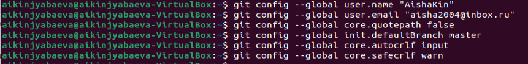

---
## Front matter
title: "Отчёт по лабораторной работе №2"
subtitle: "Первоначальная настройка Git"
author: "Киньябаева Аиша Иделевна"

## Generic otions
lang: ru-RU
toc-title: "Содержание"

## Bibliography
bibliography: bib/cite.bib
csl: pandoc/csl/gost-r-7-0-5-2008-numeric.csl

## Pdf output format
toc: true # Table of contents
toc-depth: 2
lof: true # List of figures
lot: true # List of tables
fontsize: 12pt
linestretch: 1.5
papersize: a4
documentclass: scrreprt
## I18n polyglossia
polyglossia-lang:
  name: russian
  options:
	- spelling=modern
	- babelshorthands=true
polyglossia-otherlangs:
  name: english
## I18n babel
babel-lang: russian
babel-otherlangs: english
## Fonts
mainfont: PT Serif
romanfont: PT Serif
sansfont: PT Sans
monofont: PT Mono
mainfontoptions: Ligatures=TeX
romanfontoptions: Ligatures=TeX
sansfontoptions: Ligatures=TeX,Scale=MatchLowercase
monofontoptions: Scale=MatchLowercase,Scale=0.9
## Biblatex
biblatex: true
biblio-style: "gost-numeric"
biblatexoptions:
  - parentracker=true
  - backend=biber
  - hyperref=auto
  - language=auto
  - autolang=other*
  - citestyle=gost-numeric
## Pandoc-crossref LaTeX customization
figureTitle: "Рис."
listingTitle: "Листинг"
lofTitle: "Список иллюстраций"
lolTitle: "Листинги"
## Misc options
indent: true
header-includes:
  - \usepackage{indentfirst}
  - \usepackage{float} # keep figures where there are in the text
  - \floatplacement{figure}{H} # keep figures where there are in the text
---

# Цель работы

Целью данной работы является изучение контроля версий и создание репозитория на основе шаблона курса

# Задание

Создать репозиторий на Git

# Выполнение лабораторной работы

Регистрация на Github и заполнение основных данных репозитория (рис. @fig:001), (рис. @fig:002)

{#fig:001 width=70%}

{#fig:002 width=70%}

Базовая настройка Git с использованием имени пользователя и электронной почты (рис. @fig:003 )

{#fig:003 width=70%}

Создание SSH ключа и копирование его в репозиторий (рис. @fig:004 ), (рис. @fig:005 )

{#fig:004 width=70%}

{#fig:005 width=70%}

Далее настраиваю параметры autocrlf и safecrlf. А также генерирую ключ gpg и копирую его на git (рис. @fig:006 )

{#fig:006 width=70%}

Настройка автоматических подписей коммитов git (рис. @fig:007 )

{#fig:007 width=70%}

Копирование шаблона курса (рис. @fig:008 )

{#fig:008  width=70%}

Настройка каталога курса и отправка файлов на репозиторий (рис. @fig:009 ), (рис. @fig:010 )

{#fig:009  width=70%}

{#fig:010  width=70%}

КОНТРОЛЬНЫЕ ВОПРОСЫ

1. Что такое системы контроля версий (VCS) и для решения каких задач они предназначаются?
   Системы контроля версий необходимы при работе нескольких человек над одним проектом. Прдназначены для решения таких задач как:
   - внесение изменений в проект разными участниками
   - совмещение изменений
   - возврат к более ранним версиям проекта
   - сохранение изменений
2. Объясните следующие понятия VCS и их отношения: хранилище, commit, история, рабочая копия.
   - Репозиторий - место хранения файловой ситсемы каждого отдельного проекта. Существуют локальные и удаленные репозитории, где локальные для работы над проектом на компьютере, а удаленные в качестве хранилища
   - Commit - Операция, позволяющая сохранить текущее состояние проекта и добавить его в репозиторий
   - История - способность системы контроля версий сохранять и работать с несколькими версиями одного файла и его ветвлений
   - Рабочая копия - является снимком одной версии проекта. Эти файлы извлекаются из сжатой базы данных в каталоге Git и помещаются на диск, для того чтобы их можно было использовать или редактировать.
3. Что представляют собой и чем отличаются централизованные и децентрализованные VCS? Приведите примеры VCS каждого вида.
   - Централизованные  системы контроля версий предполагают сохранение версий проектов на  общий сервер, с которого потом получают нужные версии клиенты.
  Примеры:  CVS, Subversion, Perforce
   - В децентрализованных системах контроля версий при каждом копировании удалённого репозитория (расположенного на сервере) происходит полное копирование данных в локальный репозиторий (установленный на рабочем компьютере). Каждая копия содержит все данные, хранящиеся в удалённом репозитории. В случае, возникновения технической неисправности на стороне сервера, удаленный репозиторий можно перезаписать с любой сохраненной копии.
  Пример:  Mercurial, Bazaar
4. Опишите действия с VCS при единоличной работе с хранилищем.
   - Создадим локальный репозиторий.
   - Сделаем предварительную конфигурацию, указав имя и email владельца репозитория
   - Инициализация локального репозитория, расположенного, например, в каталоге ~/tutorial
   - После это в каталоге tutorial появится каталог .git, в котором будет храниться история изменений.
   - Воспользуемся командой status для просмотра изменений в рабочем каталоге, сделанных с момента последней ревизии:git status
   - Во время работы над проектом так или иначе могут создаваться файлы, которые не требуется добавлять в последствии в репозиторий. Например, временные файлы, создаваемые редакторами, или объектные файлы, создаваемые компиляторами. Можно прописать шаблоны игнорируемых при добавлении в репозиторий типов файлов в файл .gitignore с помощью сервисов. Для этого сначала нужно получить список имеющихся шаблонов
5. Каковы основные задачи, решаемые инструментальным средством git?
   Git не только позволяет сохранять контрольные точки проекта, но и помогает устранять конфликты. Часто бывает так, что программисты одновременно работают над одной функцией и заливают изменения в репозиторий. В этом случае система обнаруживает конфликт и пытается исправить его автоматически.
7. Назовите и дайте краткую характеристику командам git.
   - Создание основного дерева репозитория
   git init

   - Получение обновлений (изменений) текущего дерева из центрального репозитория:
   git pull

   - Отправка всех произведённых изменений локального дерева в центральный репозиторий:
   git push

   - Просмотр списка изменённых файлов в текущей директории:
   git status

   - Добавить все изменённые и/или созданные файлы и/или каталоги:
   git add .

   - Удалить файл и/или каталог из индекса репозитория (при этом файл и/или каталог остаётся в локальной директории):
   git rm имена_файлов

   - Сохранить все добавленные изменения и все изменённые файлы:
   git commit -am 'Описание коммита'

   - Сохранить добавленные изменения с внесением комментария через встроенный редактор:
   git commit

   - Отправка изменений конкретной ветки в центральный репозиторий:
   git push origin имя_ветки
8. Что такое и зачем могут быть нужны ветви (branches)?
   Ветки нужны для того, чтобы программисты могли вести совместную работу над проектом и не мешать друг другу при этом. При создании проекта, Git создает базовую ветку. Она называется master веткой. Она считается центральной веткой, т.е. в ней содержится основной код приложения.
9. Как и зачем можно игнорировать некоторые файлы при commit?
   Игнорируемые файлы — это, как правило, артефакты сборки и файлы, генерируемые машиной из исходных файлов в вашем репозитории, либо файлы, которые по какой-либо иной причине не должны попадать в коммиты
   ЫИгнорируемые файлы отслеживаются в специальном файле .gitignore, который регистрируется в корневом каталоге репозитория. В Git нет специальной команды для указания игнорируемых файлов: вместо этого необходимо вручную отредактировать файл .gitignore, чтобы указать в нем новые файлы, которые должны быть проигнорированы. Файлы .gitignore содержат шаблоны, которые сопоставляются с именами файлов в репозитории для определения необходимости игнорировать эти файлы

# Выводы

В ходе данной лабораторной работы были изучены основные моменты создания репозитория на git, основные команды гит и непосредственно копирование файлов на репозиторий.