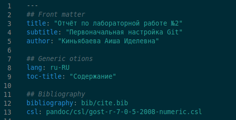
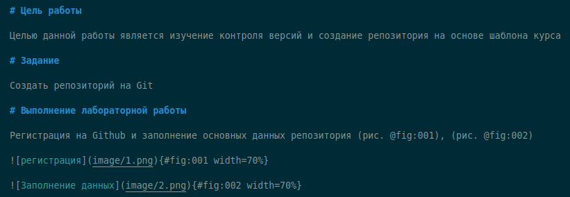
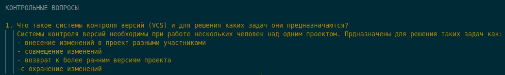
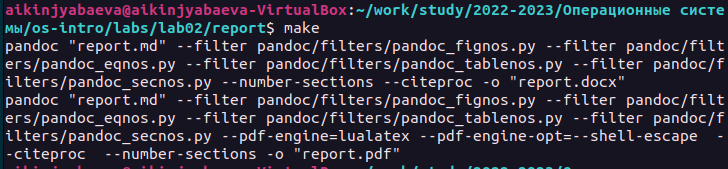
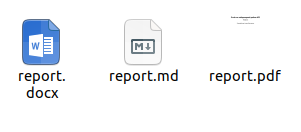

---
## Front matter
lang: ru-RU
title: Презентация по лабораторной №3
subtitle: Markdown
author:
  - Киньябаева А.И.
institute:
  - Российский университет дружбы народов, Москва, Россия
date: 21 февраля 2023

## i18n babel
babel-lang: russian
babel-otherlangs: english

## Formatting pdf
toc: false
toc-title: Содержание
slide_level: 2
aspectratio: 169
section-titles: true
theme: metropolis
header-includes:
 - \metroset{progressbar=frametitle,sectionpage=progressbar,numbering=fraction}
 - '\makeatletter'
 - '\beamer@ignorenonframefalse'
 - '\makeatother'
---

# Введение

## Цели и задачи

- Изучение языка разметки Markdown
- Создвние отчета

## Материалы и методы

- Текстовый редактор

# Выполнение лабораторной работы

## Оформление титульного листа

Основными элементы титульного листа являются:

 - Номер и название лабораторной работы
 - Автор
 - Содержание

## Основная часть отчета

В основной части отчета описывается проделанная работа. Отдельные пункты выделяются заголовками.
Прикрепленные рисунки оформляются особым способом (представлено на слайде)

## Основная часть отчета (продолжение)

Есть различные элементы оформления отчета, среди которых - выделение отдельных пунктов и подунктов.

## Форматы отчета

После написания отчета на языке Markdown следует отформатировать файл в различные и более удобные виды (pdf и docx). Для этого используетяс команда make

# Результаты

## Полученные сведения

На выходе получаем отчет в 3х форматах

## Итоги

В ходе работы был изучен язык разметки Markdown, получены основные сведения оформления отчетов на данном языке, а также способы форматирования полученного файла.