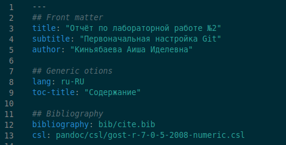
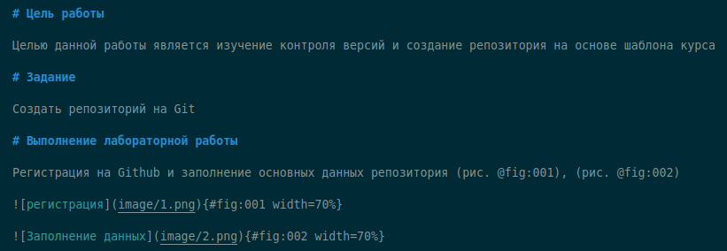
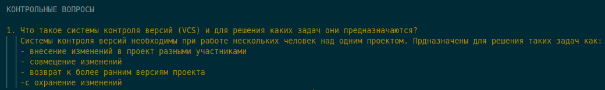
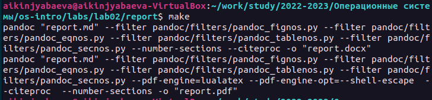

---
## Front matter
title: "Отчёт по лабораторной работе №3"
subtitle: "Markdown"
author: "Киньябаева Аиша Иделевна"

## Generic otions
lang: ru-RU
toc-title: "Содержание"

## Bibliography
bibliography: bib/cite.bib
csl: pandoc/csl/gost-r-7-0-5-2008-numeric.csl

## Pdf output format
toc: true # Table of contents
toc-depth: 2
lof: true # List of figures
lot: true # List of tables
fontsize: 12pt
linestretch: 1.5
papersize: a4
documentclass: scrreprt
## I18n polyglossia
polyglossia-lang:
  name: russian
  options:
	- spelling=modern
	- babelshorthands=true
polyglossia-otherlangs:
  name: english
## I18n babel
babel-lang: russian
babel-otherlangs: english
## Fonts
mainfont: PT Serif
romanfont: PT Serif
sansfont: PT Sans
monofont: PT Mono
mainfontoptions: Ligatures=TeX
romanfontoptions: Ligatures=TeX
sansfontoptions: Ligatures=TeX,Scale=MatchLowercase
monofontoptions: Scale=MatchLowercase,Scale=0.9
## Biblatex
biblatex: true
biblio-style: "gost-numeric"
biblatexoptions:
  - parentracker=true
  - backend=biber
  - hyperref=auto
  - language=auto
  - autolang=other*
  - citestyle=gost-numeric
## Pandoc-crossref LaTeX customization
figureTitle: "Рис."
listingTitle: "Листинг"
lofTitle: "Список иллюстраций"
lolTitle: "Листинги"
## Misc options
indent: true
header-includes:
  - \usepackage{indentfirst}
  - \usepackage{float} # keep figures where there are in the text
  - \floatplacement{figure}{H} # keep figures where there are in the text
---

# Цель работы

Целью данной работы является изучение языка разметки Markdown и создание отчета на нем.

# Задание

Создать отчет на языке Markdown и преобразовать в форматы docx, pdf.

# Выполнение лабораторной работы

Выполнение лабораторной работы состоит в создании отчета по проделанной работе с использованием шаблона .

Первым делом оформляю титульный лист, в котором прописываю номер лабораторной работы, ее название и автора (т.е. себя) (рис. @fig:001)

{#fig:001 width=70%}

Далее заполняю сам отчет. Ключевыми элементами в нем являются заголовки обозначенные хэштегом и рисунки с подписями. Их оформление представлено ниже. (рис. @fig:002)

{#fig:002 width=70%}

Также можно увидеть оформление пунктов и подпунктов в Markdown (рис. @fig:003)

{#fig:003 width=70%}

Далее с помощью команды make преобразовываю файл в форматы док и пдф (рис. @fig:004 )

{#fig:004 width=70%}

Созданные файлы отправляю на репозиторий

# Выводы

В ходе данной лабораторной работы были изучены основы языка разметки Markdown и был составлен отчет на нем.