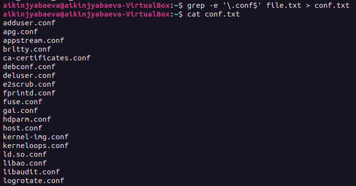
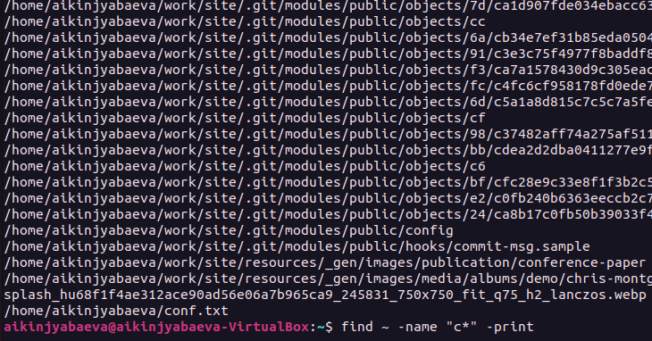
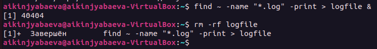
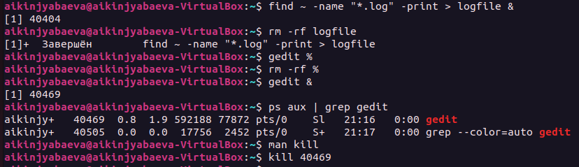

---
## Front matter
lang: ru-RU
title: Презентация по лабораторной №6
subtitle: Поиск Файлов
author:
  - Киньябаева А.И.
institute:
  - Российский университет дружбы народов, Москва, Россия
date: 18 марта 2023

## i18n babel
babel-lang: russian
babel-otherlangs: english

## Formatting pdf
toc: false
toc-title: Содержание
slide_level: 2
aspectratio: 169
section-titles: true
theme: metropolis
header-includes:
 - \metroset{progressbar=frametitle,sectionpage=progressbar,numbering=fraction}
 - '\makeatletter'
 - '\beamer@ignorenonframefalse'
 - '\makeatother'
---

# Введение

## Цели и задачи

- Перенаправление потоков ввода-вывода
- Поиск файлов

## Материалы и методы

- Терминал

# Выполнение лабораторной работы

## Поиск и перенос файлов

На слайде можно посмотреть с помощью каких команд воспроизводится поиск файлов и дальнейшее перенаправление в другой файл

## Фильтрация файлов

Данная команда позволяет находить файлы, к примеру, начинающиеся на определенную букву, и выводить их на экран

## Фоновые процессы

В терминале большие по объему процессы можно запускать фоново

## Остановка фоновых процессов

Для остановки фоновых процессов необходимо найти номер процесса и остановить его с помощью команды кил

# Результаты

## Полученные сведения

Отфильтрованные списки файлов

## Итоги

В ходе работы были изучены методы перенаправления ввода-вывода и сортировка файловых списков.