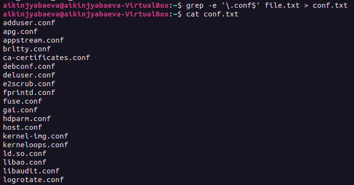
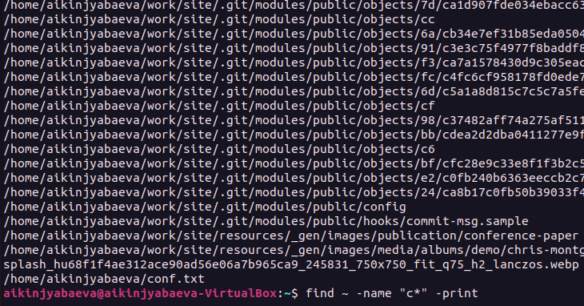
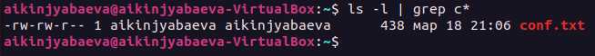
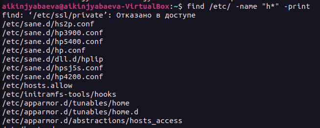
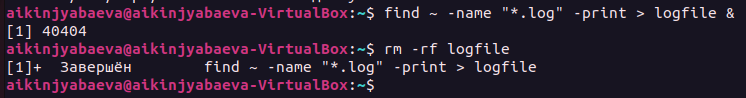
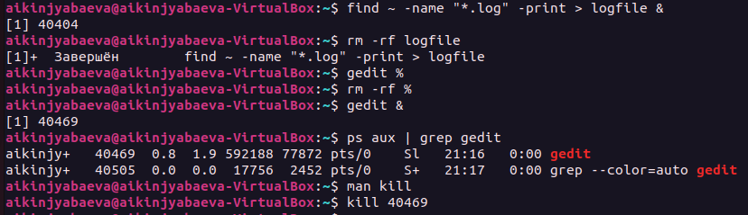

---
## Front matter
title: "Отчёт по лабораторной работе №6"
subtitle: "Поиск файлов"
author: "Киньябаева Аиша Иделевна"

## Generic otions
lang: ru-RU
toc-title: "Содержание"

## Bibliography
bibliography: bib/cite.bib
csl: pandoc/csl/gost-r-7-0-5-2008-numeric.csl

## Pdf output format
toc: true # Table of contents
toc-depth: 2
lof: true # List of figures
lot: true # List of tables
fontsize: 12pt
linestretch: 1.5
papersize: a4
documentclass: scrreprt
## I18n polyglossia
polyglossia-lang:
  name: russian
  options:
	- spelling=modern
	- babelshorthands=true
polyglossia-otherlangs:
  name: english
## I18n babel
babel-lang: russian
babel-otherlangs: english
## Fonts
mainfont: PT Serif
romanfont: PT Serif
sansfont: PT Sans
monofont: PT Mono
mainfontoptions: Ligatures=TeX
romanfontoptions: Ligatures=TeX
sansfontoptions: Ligatures=TeX,Scale=MatchLowercase
monofontoptions: Scale=MatchLowercase,Scale=0.9
## Biblatex
biblatex: true
biblio-style: "gost-numeric"
biblatexoptions:
  - parentracker=true
  - backend=biber
  - hyperref=auto
  - language=auto
  - autolang=other*
  - citestyle=gost-numeric
## Pandoc-crossref LaTeX customization
figureTitle: "Рис."
listingTitle: "Листинг"
lofTitle: "Список иллюстраций"
lolTitle: "Листинги"
## Misc options
indent: true
header-includes:
  - \usepackage{indentfirst}
  - \usepackage{float} # keep figures where there are in the text
  - \floatplacement{figure}{H} # keep figures where there are in the text
---

# Цель работы

Целью данной работы является ознакомление с инструментами поиска файлов и фильтрации текстовых данных, а также приобретение практических навыков: по управлению процессамию

# Задание

Выполнить перечисленные задания по поиску файлов и перенаправлению ввода-вывода

# Выполнение лабораторной работы

Первым делом создаю файл file.txt, в который перемещаю все названия файлов из каталога /етс. Далее фильтрую из них все файлы вида .conf и перемещаю в фпайл cong.txt (рис. @fig:001)

{#fig:001 width=70%}

Следующим заданием сортирую все файлы начинающиеся на с и вывожу на экран(рис. @fig:002)

{#fig:002 width=70%}

Также второй метод сделать ту же операцию (на этот раз поиск в другом каталоге) (рис. @fig:003)

{#fig:003 width=70%}

Ищу все файлы, начинающиеся на Н (рис. @fig:004 )

{#fig:004 width=70%}

Дальше запускаю фоновый процесс на перенос файлов типа лог в логфайл(рис. @fig:005 )

{#fig:005 width=70%}

Ну и последними пунктами открываю фоново текстовый редактор и в дальнейшем узнаю номер процесса и с помощью команды кил останавливаю его(рис. @fig:006 )

{#fig:006 width=70%}

# Контрольные вопросы

1. В системе по умолчанию открыто три специальных потока:
  – stdin — стандартный поток ввода (по умолчанию: клавиатура), файловый дескриптор 0;
  – stdout — стандартный поток вывода (по умолчанию: консоль), файловый дескриптор 1;
  – stderr — стандартный поток вывод сообщений об ошибках (по умолчанию: консоль), файловый дескриптор 2.

2. ">" Перенаправление вывода (stdout) в файл
   ">>" Перенаправление вывода (stdout) в файл, который открывается в режиме добавления

3. Конвейер (pipe) служит для объединения простых команд или утилит в цепочки, в которых результат работы предыдущей команды передаётся последующей.

4. Любой команде, выполняемой в системе, присваивается идентификатор процесса (process ID). 

5. GID– это идентификационный номер группы данного процесса. 
   Каждому процессу Linux или Unix или выполняемой программе, автоматически присваивается идентификационный номер уникального процесса (PID)

6. Любую выполняющуюся в консоли команду или внешнюю программу можно запустить в фоновом режиме. Для этого следует в конце имени команды указать знак амперсанда &. 

7. top - интерактивный просмотрщик процессов. htop аналог top. 

8. Команда find используется для поиска и отображения на экран имён файлов, соответствующих заданной строке символов. 

# Выводы

В ходе данной лабораторной работы были изучены методы пернаправления потоков ввода-вывода, а также методы поиска файлов в каталогахю