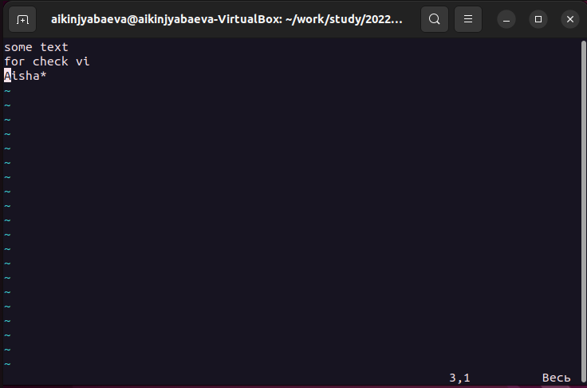
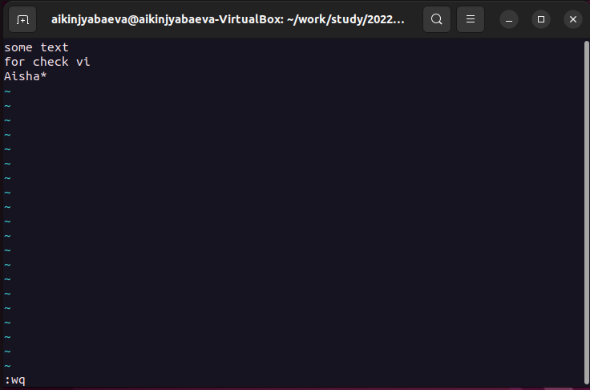
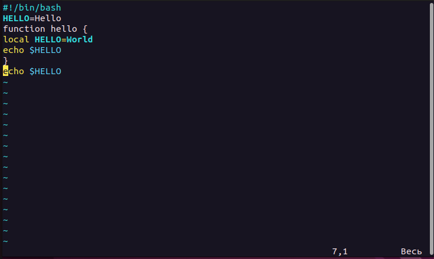

---
## Front matter
lang: ru-RU
title: Презентация по лабораторной №8
subtitle: Редактор VI
author:
  - Киньябаева А.И.
institute:
  - Российский университет дружбы народов, Москва, Россия
date: 1 апреля 2023

## i18n babel
babel-lang: russian
babel-otherlangs: english

## Formatting pdf
toc: false
toc-title: Содержание
slide_level: 2
aspectratio: 169
section-titles: true
theme: metropolis
header-includes:
 - \metroset{progressbar=frametitle,sectionpage=progressbar,numbering=fraction}
 - '\makeatletter'
 - '\beamer@ignorenonframefalse'
 - '\makeatother'
---

# Введение

## Цели и задачи

- Изучение команд редактора
- редактирование исполняемого файла

## Материалы и методы

- Редактор VI
- Терминал

# Выполнение лабораторной работы

## Изучение команд редактора

На некотром текстовом файле изучаю основные команды редактора Vi. К примеру, переход в конец файла и далее переход в начало строки

{width=60%}

## Выход из редактора

Еще одной важной командой является выход из редактора с сохранением изменений

{width=60%}

## Выполнение основной части 

В основной части копирую программу и редактирую ее. На слайде один из шагов редактирования, промежуточный результат

{width=60%}

## Запуск обновленной программы

После изменений программы запускаю файл и вижу следующий результат (слайд)

# Результаты

## Полученные сведения

Знания об основных командах редактора. Исправленный исполняемый файл и рабочая программа

## Итоги

В ходе работы были изучены команды редактора VI, методы редактирования файлов.