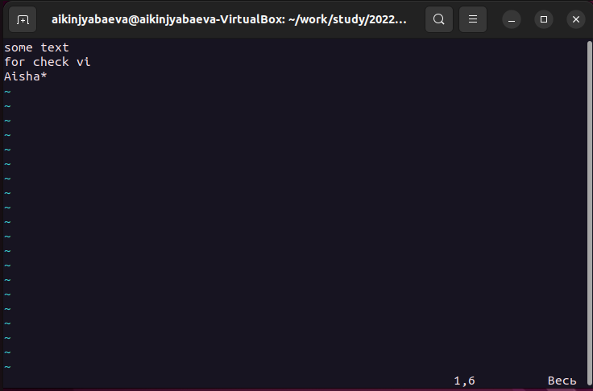
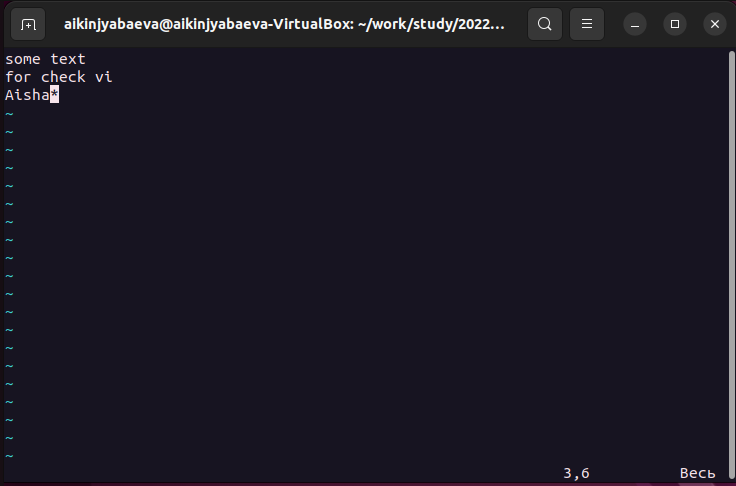
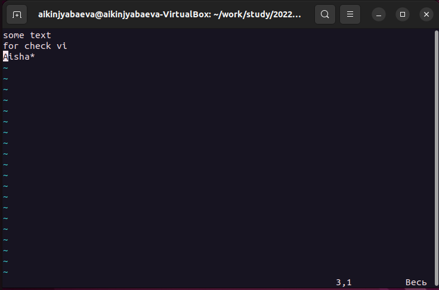
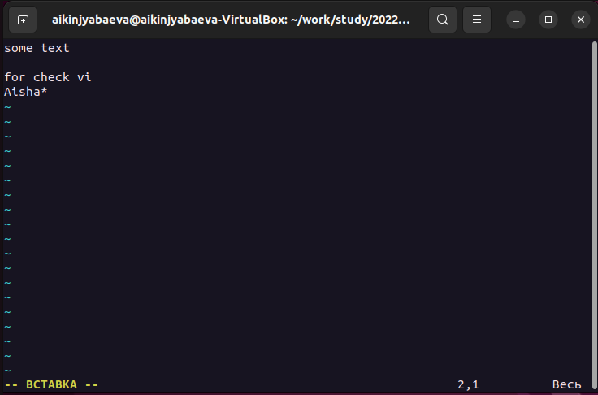
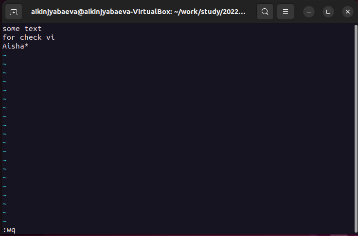
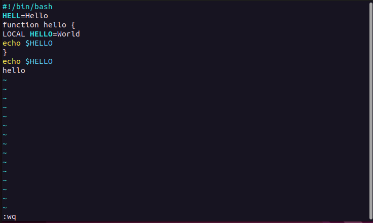
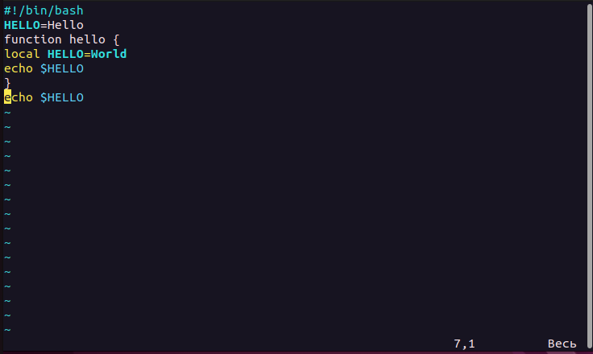
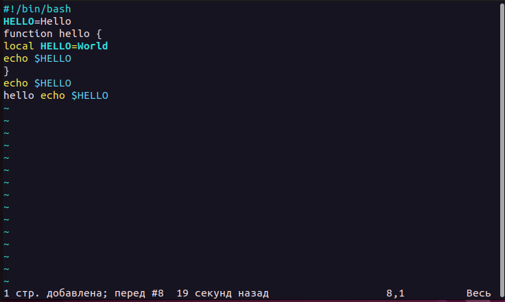
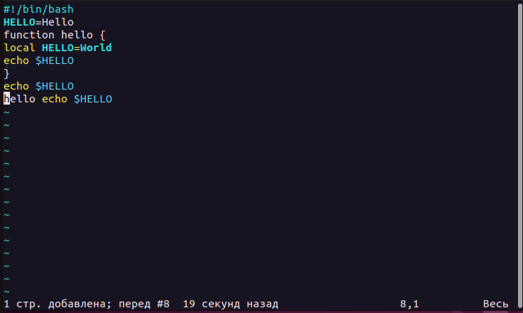
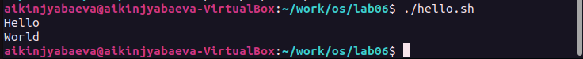

---
## Front matter
title: "Отчёт по лабораторной работе №8"
subtitle: "Редактор VI"
author: "Киньябаева Аиша Иделевна"

## Generic otions
lang: ru-RU
toc-title: "Содержание"

## Bibliography
bibliography: bib/cite.bib
csl: pandoc/csl/gost-r-7-0-5-2008-numeric.csl

## Pdf output format
toc: true # Table of contents
toc-depth: 2
lof: true # List of figures
lot: true # List of tables
fontsize: 12pt
linestretch: 1.5
papersize: a4
documentclass: scrreprt
## I18n polyglossia
polyglossia-lang:
  name: russian
  options:
	- spelling=modern
	- babelshorthands=true
polyglossia-otherlangs:
  name: english
## I18n babel
babel-lang: russian
babel-otherlangs: english
## Fonts
mainfont: PT Serif
romanfont: PT Serif
sansfont: PT Sans
monofont: PT Mono
mainfontoptions: Ligatures=TeX
romanfontoptions: Ligatures=TeX
sansfontoptions: Ligatures=TeX,Scale=MatchLowercase
monofontoptions: Scale=MatchLowercase,Scale=0.9
## Biblatex
biblatex: true
biblio-style: "gost-numeric"
biblatexoptions:
  - parentracker=true
  - backend=biber
  - hyperref=auto
  - language=auto
  - autolang=other*
  - citestyle=gost-numeric
## Pandoc-crossref LaTeX customization
figureTitle: "Рис."
listingTitle: "Листинг"
lofTitle: "Список иллюстраций"
lolTitle: "Листинги"
## Misc options
indent: true
header-includes:
  - \usepackage{indentfirst}
  - \usepackage{float} # keep figures where there are in the text
  - \floatplacement{figure}{H} # keep figures where there are in the text
---

# Цель работы

Целью данной работы является ознакомление с операционной системой Linux, получение практических навыков работы с редактором vi

# Задание

Редактирование файлов с помощью редактора vi

# Выполнение лабораторной работы

Первым делом создаю файл, в который помещаю какой-либо текст для работы с ним, проверки команд редактора vi(рис. @fig:001)

{#fig:001 width=70%}

Просматриваю различные команды, к примеру:

- Переход в конец файла с помощью команды G(рис. @fig:002)

{#fig:002 width=70%}

- Переход в начало строки (0)(рис. @fig:003)

{#fig:003 width=70%}

- Добавление пустой строки (o)(рис. @fig:004 )

{#fig:004 width=70%}

- Переход на слово вперед (W)(рис. @fig:005 )

{#fig:005 width=70%}

- Выход из редактора (:wq)(рис. @fig:006 )

{#fig:006 width=70%}

Далее создаю новый каталог и исполняемый файл(рис. @fig:007 )

{#fig:007 width=70%}

Копирование данной нам программы(рис. @fig:008 )

{#fig:008 width=70%}

Редактирование программы по указанным пунктам(рис. @fig:009 ), (рис. @fig:010 ), (рис. @fig:011 )

{#fig:009 width=70%}

{#fig:010 width=70%}

{#fig:011 width=70%}

Запуск исполняемого файла(рис. @fig:012 )

{#fig:012 width=70%}

# Контрольные вопросы

1. Редактор vi имеет три режима работы: – командный режим — предназначен для ввода команд редактирования и навигации по редактируемому файлу; – режим вставки — предназначен для ввода содержания редактируемого файла; – режим последней (или командной) строки — используется для записи изменений в файл и выхода из редактора.

2. Esc + : + q(q!)

3. 
  – 0 (ноль) — переход в начало строки; 
  – $ — переход в конец строки; 
  – G — переход в конец файла;
  – 𝑛 G — переход на строку с номером 𝑛.

4. При использовании прописных W и B под разделителями понимаются только пробел, табуляция и возврат каретки. При использовании строчных w и b под разделителями понимаются также любые знаки пунктуации.

5. 
  – G — переход в конец файла;
  – 0 (ноль) — переход в начало строки;
6. 
   • Вставка текста
   • Вставка строки
   • Удаление текста
   • Отмена и повтор произведённых изменений
   • Копирование текста в буфер
   • Вставка текста из буфера
   • Замена текста
   • Поиск текста
7. F
8. – u — отменить последнее изменение;
9. Копирование и перемещение текста
   Запись в файл и выход из редактора
10. F
11. Опции редактора vi позволяют настроить рабочую среду. Для задания опций используется команда set (в режиме последней строки): – : set all — вывести полный список опций; – : set nu — вывести номера строк; – : set list — вывести невидимые символы; – : set ic — не учитывать при поиске, является ли символ прописным или строчным

# Выводы

В ходе данной лабораторной работы были изучены основные команды редактора Vi и принципы редактирования текстовых (и не только) файлов.