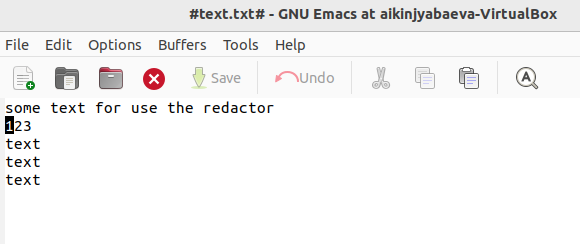
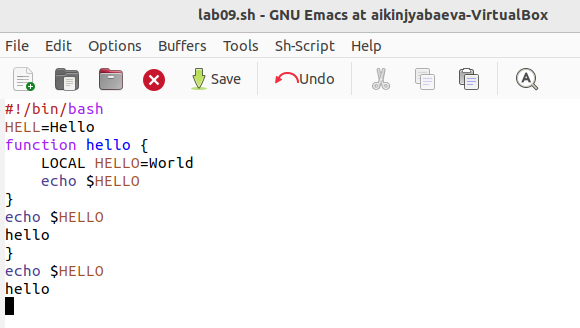
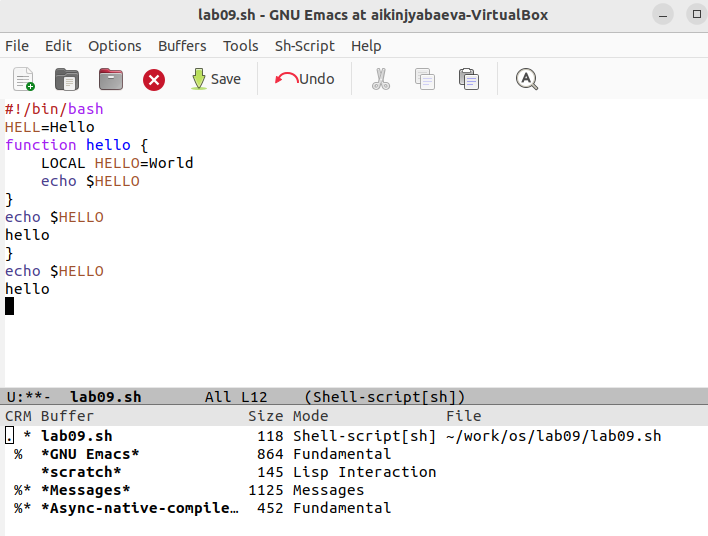
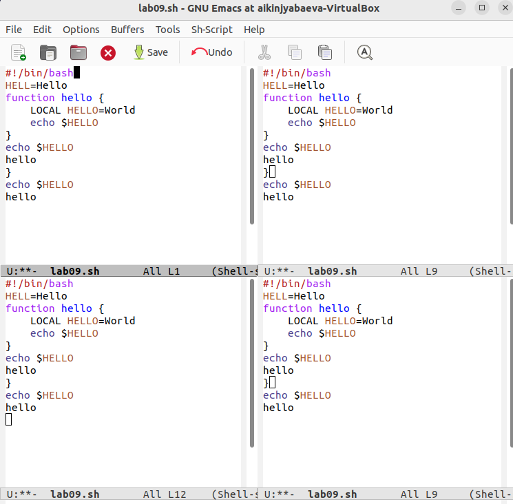
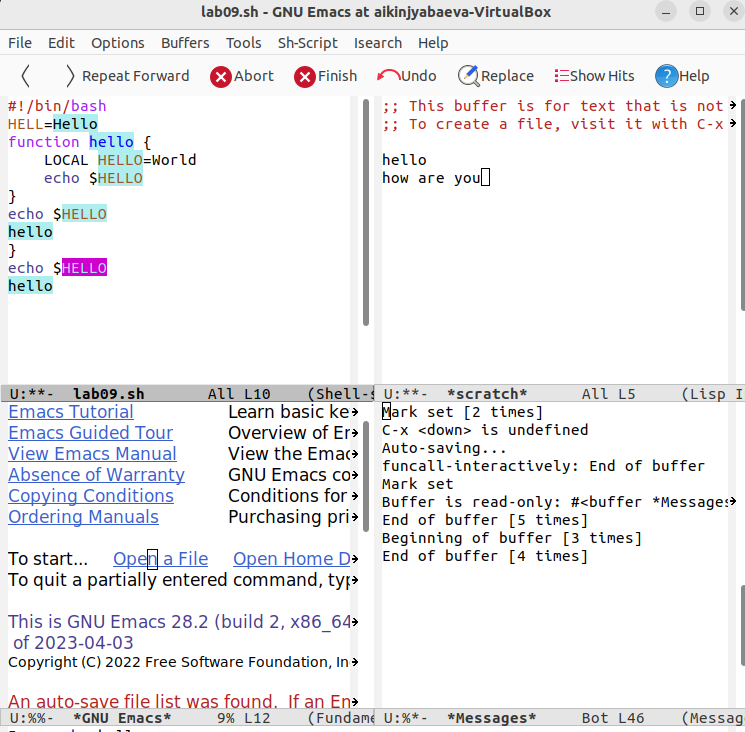
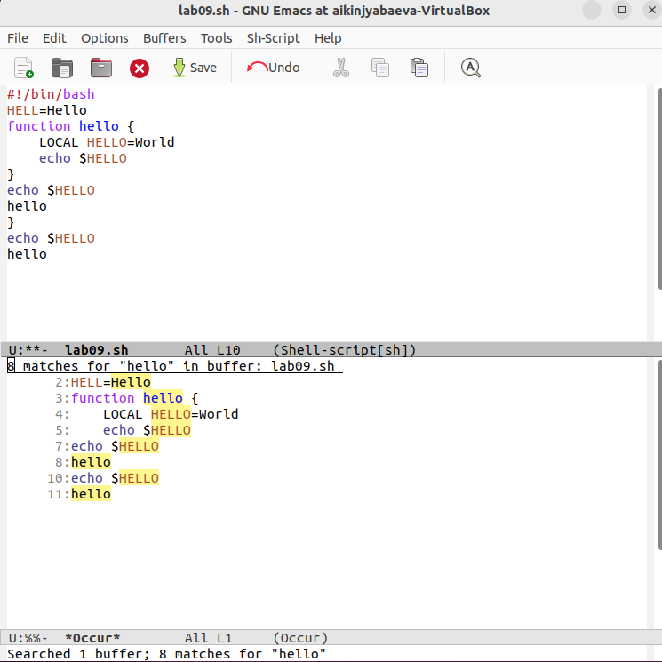

---
## Front matter
lang: ru-RU
title: Презентация по лабораторной №9
subtitle: Редактор emacs
author:
  - Киньябаева А.И.
institute:
  - Российский университет дружбы народов, Москва, Россия
date: 8 апреля 2023

## i18n babel
babel-lang: russian
babel-otherlangs: english

## Formatting pdf
toc: false
toc-title: Содержание
slide_level: 2
aspectratio: 169
section-titles: true
theme: metropolis
header-includes:
 - \metroset{progressbar=frametitle,sectionpage=progressbar,numbering=fraction}
 - '\makeatletter'
 - '\beamer@ignorenonframefalse'
 - '\makeatother'
---

# Введение

## Цели и задачи

- Изучение команд редактора
- редактирование исполняемого файла

## Материалы и методы

- Редактор emacs
- Терминал

# Выполнение лабораторной работы

## Изучение команд редактора

На некотром текстовом файле изучаю основные команды редактора Vi. К примеру, переход на одну строку вниз

{width=60%}

## Выполнение основной части 

В основной части копирую программу и выполняю различные команды. Одна из них - это выделение текста и копирование в конец файла

{width=60%}

## Буферы

В редакторе emacs работа производится с участием буферов. Их список можно вывести на экран

{width=40%}

## Разделение экрана

Еще одним удобством редактора является возможность разделения экрана

{width=40%}

## Поиск слов

В редакторе можно также организовать поиск слов

{width=40%}

## Поиск слов, второй способ

Есть второй метод поиска слов с отдельным выводом текста 

{width=40%}

# Результаты

## Полученные сведения

Знания об основных командах редактора, работа с буферами

## Итоги

В ходе работы были изучены команды редактора emacs, методы редактирования файлов.