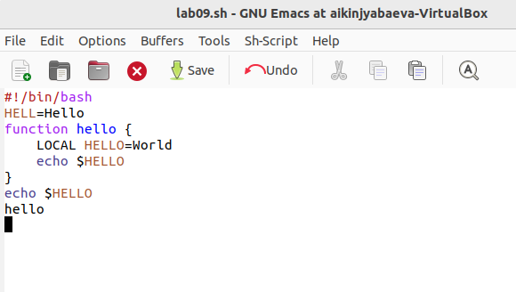

---
## Front matter
title: "Отчёт по лабораторной работе №9"
subtitle: "Редактор emacs"
author: "Киньябаева Аиша Иделевна"

## Generic otions
lang: ru-RU
toc-title: "Содержание"

## Bibliography
bibliography: bib/cite.bib
csl: pandoc/csl/gost-r-7-0-5-2008-numeric.csl

## Pdf output format
toc: true # Table of contents
toc-depth: 2
lof: true # List of figures
lot: true # List of tables
fontsize: 12pt
linestretch: 1.5
papersize: a4
documentclass: scrreprt
## I18n polyglossia
polyglossia-lang:
  name: russian
  options:
	- spelling=modern
	- babelshorthands=true
polyglossia-otherlangs:
  name: english
## I18n babel
babel-lang: russian
babel-otherlangs: english
## Fonts
mainfont: PT Serif
romanfont: PT Serif
sansfont: PT Sans
monofont: PT Mono
mainfontoptions: Ligatures=TeX
romanfontoptions: Ligatures=TeX
sansfontoptions: Ligatures=TeX,Scale=MatchLowercase
monofontoptions: Scale=MatchLowercase,Scale=0.9
## Biblatex
biblatex: true
biblio-style: "gost-numeric"
biblatexoptions:
  - parentracker=true
  - backend=biber
  - hyperref=auto
  - language=auto
  - autolang=other*
  - citestyle=gost-numeric
## Pandoc-crossref LaTeX customization
figureTitle: "Рис."
listingTitle: "Листинг"
lofTitle: "Список иллюстраций"
lolTitle: "Листинги"
## Misc options
indent: true
header-includes:
  - \usepackage{indentfirst}
  - \usepackage{float} # keep figures where there are in the text
  - \floatplacement{figure}{H} # keep figures where there are in the text
---

# Цель работы

Целью данной работы является ознакомление с операционной системой Linux, получение практических навыков работы с редактором emacs

# Задание

Редактирование файлов с помощью редактора emacs

# Выполнение лабораторной работы

Первым делом создаю файл, в который помещаю какой-либо текст для работы с ним, проверки команд редактора emacs(рис. @fig:001)

{#fig:001 width=70%}

Просматриваю различные команды, к примеру:

- Переход на одну строку вниз с помощью команды C-n(рис. @fig:002)

{#fig:002 width=70%}

- Переход в конец строки (С-е)(рис. @fig:003)

{#fig:003 width=70%}

- Удаление следующего символа (С-к)(рис. @fig:004 )

{#fig:004 width=70%}

- Удаление предложения (М-к)(рис. @fig:005 )

{#fig:005 width=70%}

Далее создаю исполняемый файл и печтаю в нем данный текст(рис. @fig:006 )

{#fig:006 width=70%}

Вырезаю в нем однй строку (последнюю) (С-к)(рис. @fig:007 )

{#fig:007 width=70%}

Вставка последней удаленной строки в конец файла(С-у)(рис. @fig:008 )

{#fig:008 width=70%}

Дальше я выделяю область текста и вставляю ее в конец файла(рис. fig:009 )

{#fig:009 width=70%}

Вырезаю выделенный текст (C-w)(рис. @fig:010 )

{#fig:010 width=70%}

Отменяю последнее действие с помощью команды(С-/)(рис. @fig:011 )

{#fig:011 width=70%}

Перемещение курсора в начало строки(рис. @fig:012 )

{#fig:012 width=70%}

Перемещение курсора в конец строки(рис. @fig:013 )

{#fig:013 width=70%}

Перемещение курсора в начало буфера(рис. @fig:014 )

{#fig:014 width=70%}

Перемещение курсора в конец буфера(рис. @fig:015 )

{#fig:015 width=70%}

Вывожу спсиок активных буферов на экран(рис. @fig:016 )

{#fig:016 width=70%}

Перемщаюсь в другой буфер(рис. @fig:017 )

{#fig:017 width=70%}

Переключаюсь на другой буфер без вывода его на экран(рис. @fig:018 )

{#fig:018 width=70%}

Разделение экрана на 4(рис. @fig:019 )

{#fig:019 width=70%}

Открываю в каждом экране один из буферов(рис. @fig:020 )

{#fig:020 width=70%}

Поиск слов в тексте с помощью команды С-s(рис. @fig:021 )

{#fig:021 width=70%}

Переключение между найденными словами с помощью команды С-s(рис. @fig:022 )

{#fig:022 width=70%}

Замена найденного слова на другое с помощью команды М-%(рис. @fig:023 )

{#fig:023 width=70%}

Также проверяю поиск слов с помощью команды М-s. Основным отличием от прошлой команды поиска является вывод текста с выделенными словами в отдельный буфер(рис. @fig:024 )

{#fig:024 width=70%}

# Контрольные вопросы

1. Emacs представляет собой мощный экранный редактор текста, написанный на языке высокого уровня Elisp.

2. Сложность может вызвать наличие буфера

3. Буфер - это место расположения текста, команд. а окно - место вывода буфера со своей строкой состояния

4. Нет, т.к. в одном окне открываетяс один буфер

5. 
  – G — переход в конец файла;
  – 0 (ноль) — переход в начало строки;
6. Я нажму клавиши ctrl+c + shift '\'

7. ctrl+x + 2

10. Оба редактора показались мне одинаковыми в использовании, разница мала

# Выводы

В ходе данной лабораторной работы были изучены основные команды редактора emacs и принципы редактирования текстовых (и не только) файлов.