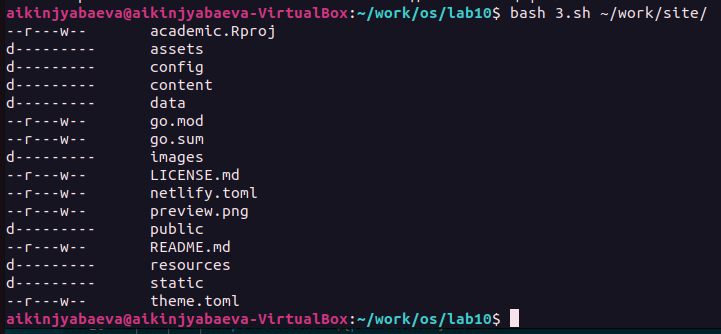

---
## Front matter
title: "Отчёт по лабораторной работе №10"
subtitle: "Программирование в командном процессоре ОС UNIX. Командные файлы"
author: "Киньябаева Аиша Иделевна"

## Generic otions
lang: ru-RU
toc-title: "Содержание"

## Bibliography
bibliography: bib/cite.bib
csl: pandoc/csl/gost-r-7-0-5-2008-numeric.csl

## Pdf output format
toc: true # Table of contents
toc-depth: 2
lof: true # List of figures
lot: true # List of tables
fontsize: 12pt
linestretch: 1.5
papersize: a4
documentclass: scrreprt
## I18n polyglossia
polyglossia-lang:
  name: russian
  options:
	- spelling=modern
	- babelshorthands=true
polyglossia-otherlangs:
  name: english
## I18n babel
babel-lang: russian
babel-otherlangs: english
## Fonts
mainfont: PT Serif
romanfont: PT Serif
sansfont: PT Sans
monofont: PT Mono
mainfontoptions: Ligatures=TeX
romanfontoptions: Ligatures=TeX
sansfontoptions: Ligatures=TeX,Scale=MatchLowercase
monofontoptions: Scale=MatchLowercase,Scale=0.9
## Biblatex
biblatex: true
biblio-style: "gost-numeric"
biblatexoptions:
  - parentracker=true
  - backend=biber
  - hyperref=auto
  - language=auto
  - autolang=other*
  - citestyle=gost-numeric
## Pandoc-crossref LaTeX customization
figureTitle: "Рис."
listingTitle: "Листинг"
lofTitle: "Список иллюстраций"
lolTitle: "Листинги"
## Misc options
indent: true
header-includes:
  - \usepackage{indentfirst}
  - \usepackage{float} # keep figures where there are in the text
  - \floatplacement{figure}{H} # keep figures where there are in the text
---

# Цель работы

Целью данной работы является изучение основ программирования в оболочке ОС UNIX/Linux, научиться писать небольшие командные файлы.

# Задание

Создание командных файлов

# Выполнение лабораторной работы

Создаю четыре скрипта для четерых заданий по лабораторной работе. И пишу первую программу, по которой скрипт должен копировать и архивировать себя в некоторый каталог (который при отстуствии создаем) (рис. @fig:001)

{#fig:001 width=50%}

Далее запускаю скрипт и смотрю на полученыый результат (рис. @fig:002), (рис. @fig:003)

{#fig:002 width=70%}

{#fig:003 width=50%}

Содержимое скрипта второго задания, по которому нам необходимо произвести некоторое действие с введенными файлами (я их просто пересчиитываю) (рис. @fig:004 ), (рис. @fig:005 )

{#fig:004 width=60%}

{#fig:005 width=70%}

Следующая команда, заменяющая команду ls и результат ее работы(рис. @fig:006 ), (рис. @fig:007 )

{#fig:006 width=70%}

{#fig:007 width=70%}

И последнее задание, по которому вычисляем количество файлов определенного типа в каталоге(рис. @fig:008 ), (рис. fig:009 )

{#fig:008 width=70%}

{#fig:009 width=70%}

Ну и в завершение работы выкладываю все на гит

# Контрольные вопросы

1. Объясните понятие командной оболочки. Приведите примеры командных оболочек. Чем они отличаются? \
  Командный процессор (командная оболочка, интерпретатор команд shell) — это программа, позволяющая пользователю взаимодействовать с операционной системой компьютера. В операционных системах типа UNIX/Linux наиболее часто используются следующие реализации командных оболочек: – оболочка Борна (Bourne shell или sh) — стандартная командная оболочка UNIX/Linux, содержащая базовый, но при этом полный набор функций; – С-оболочка (или csh) — надстройка на оболочкой Борна, использующая С-подобный синтаксис команд с возможностью сохранения истории выполнения команд; – оболочка Корна (или ksh) — напоминает оболочку С, но операторы управления программой совместимы с операторами оболочки Борна; – BASH — сокращение от Bourne Again Shell (опять оболочка Борна), в основе своей совмещает свойства оболочек С и Корна (разработка компании Free Software Foundation).
2. Что такое POSIX? 
  POSIX (Portable Operating System Interface for Computer Environments) — набор стандартов описания интерфейсов взаимодействия операционной системы и прикладных программ
3. Как определяются переменные и массивы в языке программирования bash? 
  К любому выбранному имени переменной через знак равно присваивается значение. Далее можно вновь обратиться к переменной через символы ${имя переменной}
  Для создания массива используется команда set с флагом -A. За флагом следует имя переменной, а затем список значений, разделённых пробелами
4. Каково назначение операторов let и read?
  Оболочка bash поддерживает встроенные арифметические функции. Команда let является показателем того, что последующие аргументы представляют собой выражение, подлежащее вычислению
  Команда read позволяет читать значения переменных со стандартного ввода 
5. Какие арифметические операции можно применять в языке программирования bash?
  Классические арифметические операции: сложение, вычитание, умножение, деление. А также множество других операций по типу: остаток от деления, побитное перемещение, отрицание и сравнение.
6. Что означает операция (( ))? 
  Используется для облегчения программирования и обозначается как условие
7. Какие стандартные имена переменных Вам известны? 
    •  HOME — имя домашнего каталога пользователя. Если команда cd вводится без аргументов, то происходит переход в каталог, указанный в этой переменной. 
    • IFS — последовательность символов, являющихся разделителями в командной строке, например, пробел, табуляция и перевод строки (new line). 
    • MAIL — командный процессор каждый раз перед выводом на экран промптера проверяет содержимое файла, имя которого указано в этой переменной, и если содержимое этого файла изменилось с момента последнего ввода из него, то перед тем как вывести на терминал промптер, командный процессор выводит на терминал сообщение You have mail (у Вас есть почта). 
    • TERM — тип используемого терминала. 
    • LOGNAME — содержит регистрационное имя пользователя, которое устанавливается автоматически при входе в систему. 
    • В командном процессоре Си имеется ещё несколько стандартных переменных. Значение всех переменных можно просмотреть с помощью команды set.
8. Что такое метасимволы? 
  Это различные символы (\ | < > * » &), которые имеют особый смысл для командного процессора.
9. Как экранировать метасимволы? 
  Экранирование может быть осуществлено с помощью предшествующего метасимволу символа \, который, в свою очередь, является метасимволом.
10. Как создавать и запускать командные файлы? 
  С помощью команды bash или же после изменения разрешений просто запускать
11. Как определяются функции в языке программирования bash? 
  Группу команд можно объединить в функцию. Для этого существует ключевое слово function, после которого следует имя функции и список команд, заключённых в фигурные скобки. Удалить функцию можно с помощью команды unset c флагом -f
12. Каким образом можно выяснить, является файл каталогом или обычным файлом? 
  test -d file — истина, если файл file является каталогом.
13. Каково назначение команд set, typeset и unset? 
  Для создания массива используется команда set с флагом –A. Значение всех переменных можно просмотреть с помощью команды set.
  Если использовать typeset -i для объявления и присвоения переменной, то при последующем её применении она станет целой
  Изъять переменную из программы можно с помощью команды unset. Удалить функцию можно с помощью команды unset c флагом -f.
14. Как передаются параметры в командные файлы? 
  При вызове командного файла на выполнение параметры ему могут быть переданы точно таким же образом, как и выполняемой программе. С точки зрения командного файла эти параметры являются позиционными. Символ $ является метасимволом командного процессора. Он используется, в частности, для ссылки на параметры, точнее, для получения их значений в командном файле.

# Выводы

В ходе данной лабораторной работы были изучены основны программирования и созданы командные файлы.