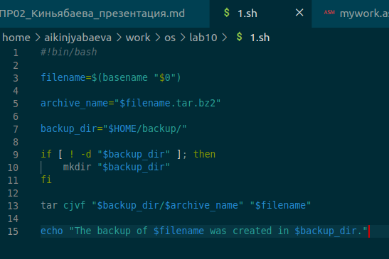
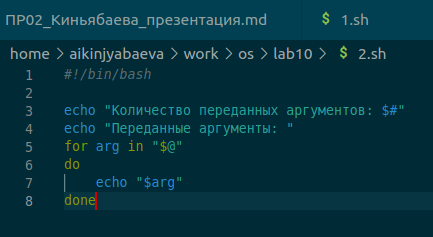
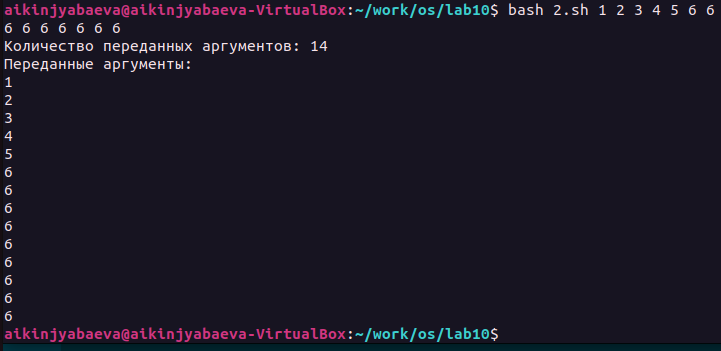
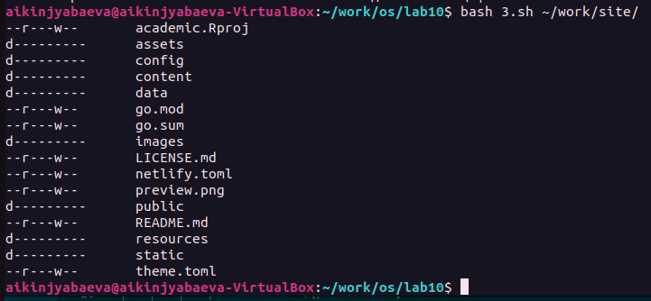
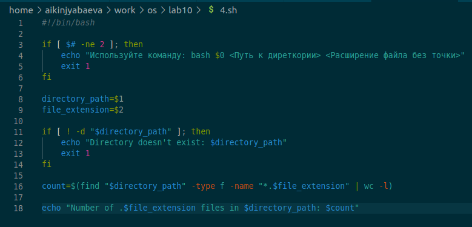

---
## Front matter
lang: ru-RU
title: Презентация по лабораторной №10
subtitle: Программирование в командном процессоре ОС UNIX. Командные файлы
author:
  - Киньябаева А.И.
institute:
  - Российский университет дружбы народов, Москва, Россия
date: 15 апреля 2023

## i18n babel
babel-lang: russian
babel-otherlangs: english

## Formatting pdf
toc: false
toc-title: Содержание
slide_level: 2
aspectratio: 169
section-titles: true
theme: metropolis
header-includes:
 - \metroset{progressbar=frametitle,sectionpage=progressbar,numbering=fraction}
 - '\makeatletter'
 - '\beamer@ignorenonframefalse'
 - '\makeatother'
---

# Введение

## Цели и задачи

- Изучение основ программирования в командном процессоре
- Создание нескольких командных файлов

## Материалы и методы

- Редактор visual studio code
- Терминал

# Выполнение лабораторной работы

## 1 задание

Прописываю команду 1го задания, для копирования текста скрипта и его архивирования

{width=50%}

## 2 задание

Также прописываю 2 программу, которая работает с введенными числами. Например, считает их количество

{width=60%}

## Результат

Результат работы 2 программы

{width=60%}

## 3 задание

Представляю результат работы 3й программы, которая заменяет команду ls

{width=70%}

## 4 задание

Прописываю последнюю программу, которая считает количество файлов определенного типа в том или ином каталоге

{width=60%}

## Результат

Результат работы 4й программы

{width=90%}

# Результаты

## Полученные сведения

Программы, написанные на языке программирования в командном процессоре

## Итоги

В ходе работы были изучены команды программирования в командном процессоре и созданы командные файлы.