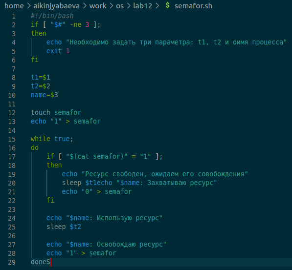
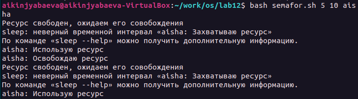
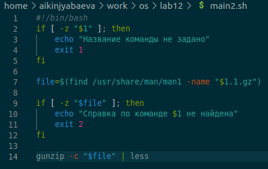
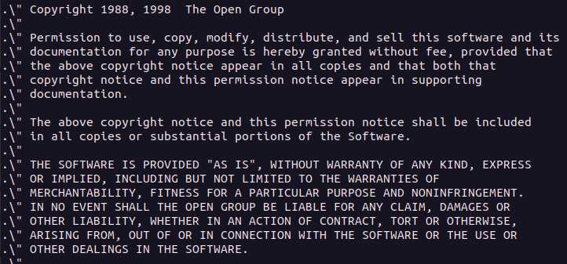
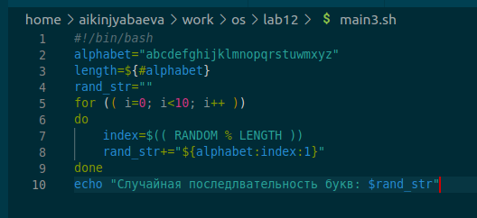
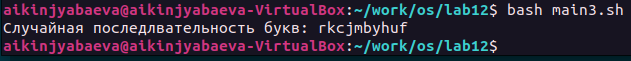

---
## Front matter
lang: ru-RU
title: Презентация по лабораторной №12
subtitle: Программирование в командном процессоре ОС UNIX. Расширенное программирование
author:
  - Киньябаева А.И.
institute:
  - Российский университет дружбы народов, Москва, Россия
date: 29 апреля 2023

## i18n babel
babel-lang: russian
babel-otherlangs: english

## Formatting pdf
toc: false
toc-title: Содержание
slide_level: 2
aspectratio: 169
section-titles: true
theme: metropolis
header-includes:
 - \metroset{progressbar=frametitle,sectionpage=progressbar,numbering=fraction}
 - '\makeatletter'
 - '\beamer@ignorenonframefalse'
 - '\makeatother'
---

# Введение

## Цели и задачи

- Изучение основ программирования в командном процессоре
- Создание нескольких командных файлов

## Материалы и методы

- Редактор visual studio code
- Терминал

# Выполнение лабораторной работы

## 1 задание

Прописываю команду 1го задания, для выполнения действий механизма семафор

{width=30%}

## Результат

Результат работы 1 программы

{width=60%}

## 2 задание

Также прописываю 2 программу, которая выводит справки о тех или иных командах

{width=50%}

## Результат

Результат работы 2 программы

{width=60%}

## 3 задание

Представляю результат работы 3й программы, которая выводит случаную последовательность букв

{width=60%}

## Результат

Результат работы 3 программы

{width=80%}

# Результаты

## Полученные сведения

Программы, написанные на языке программирования в командном процессоре

## Итоги

В ходе работы были изучены команды программирования в командном процессоре и созданы командные файлы.