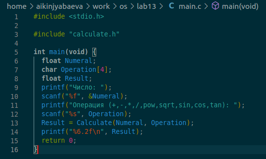
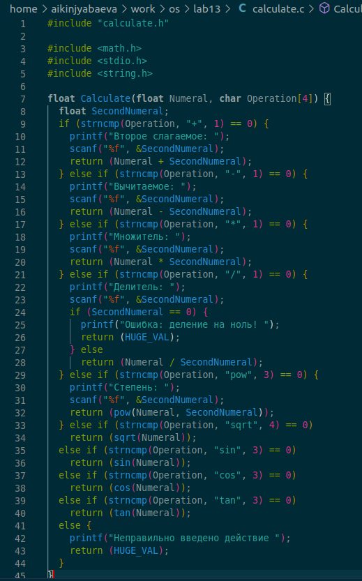
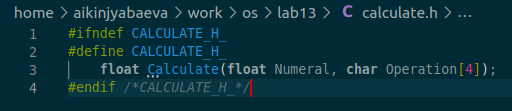
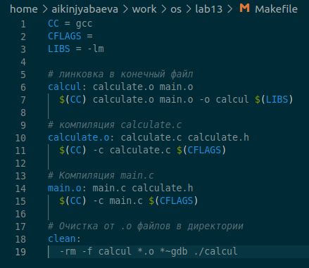
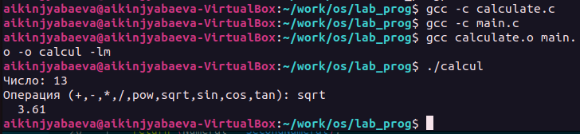

---
## Front matter
lang: ru-RU
title: Презентация по лабораторной №13
subtitle: Средства, применяемые при разработке программного обеспечения в ОС типа UNIX/Linux
author:
  - Киньябаева А.И.
institute:
  - Российский университет дружбы народов, Москва, Россия
date: 06 мая 2023

## i18n babel
babel-lang: russian
babel-otherlangs: english

## Formatting pdf
toc: false
toc-title: Содержание
slide_level: 2
aspectratio: 169
section-titles: true
theme: metropolis
header-includes:
 - \metroset{progressbar=frametitle,sectionpage=progressbar,numbering=fraction}
 - '\makeatletter'
 - '\beamer@ignorenonframefalse'
 - '\makeatother'
---

# Введение

## Цели и задачи

- Изучение основ программирования в командном процессоре
- Создание нескольких командных файлов
- Создание Makefile
- Отладка программы

## Материалы и методы

- Редактор visual studio code
- Терминал

# Выполнение лабораторной работы

## Программы (1)

Прописываю программы из задания

{width=40%}

## Программы (2)

{width=40%}

## Программы(3)

Также прописываю заголовочный файл

{width=50%}

## Makefile

Прописываю Makefile с описанием частей кода

{width=40%}

## Результат

Результат компиляции и запуска программы

{width=80%}

# Результаты

## Полученные сведения

Программы, написанные на языке программирования в командном процессоре

## Итоги

В ходе работы были изучены команды программирования в командном процессоре и созданы командные файлы, мейкфайл и изучены основные методы отладки программ