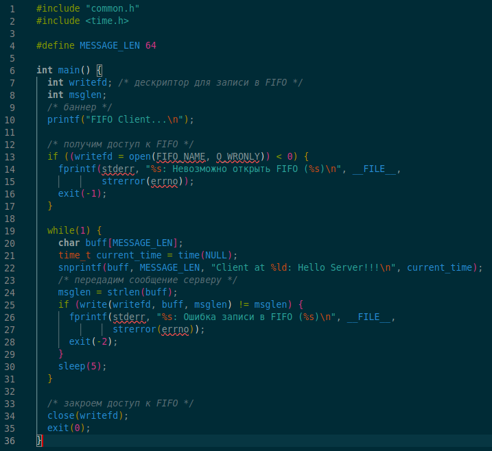
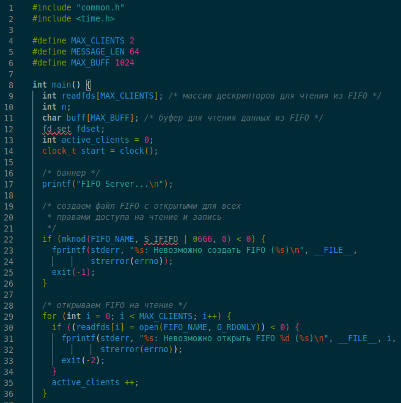
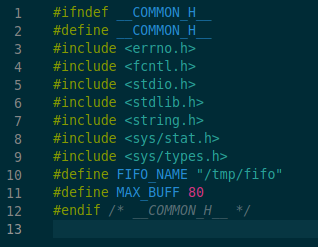

---
## Front matter
title: "Отчёт по лабораторной работе №14"
subtitle: "Именованные каналы"
author: "Киньябаева Аиша Иделевна"

## Generic otions
lang: ru-RU
toc-title: "Содержание"

## Bibliography
bibliography: bib/cite.bib
csl: pandoc/csl/gost-r-7-0-5-2008-numeric.csl

## Pdf output format
toc: true # Table of contents
toc-depth: 2
lof: true # List of figures
lot: true # List of tables
fontsize: 12pt
linestretch: 1.5
papersize: a4
documentclass: scrreprt
## I18n polyglossia
polyglossia-lang:
  name: russian
  options:
	- spelling=modern
	- babelshorthands=true
polyglossia-otherlangs:
  name: english
## I18n babel
babel-lang: russian
babel-otherlangs: english
## Fonts
mainfont: PT Serif
romanfont: PT Serif
sansfont: PT Sans
monofont: PT Mono
mainfontoptions: Ligatures=TeX
romanfontoptions: Ligatures=TeX
sansfontoptions: Ligatures=TeX,Scale=MatchLowercase
monofontoptions: Scale=MatchLowercase,Scale=0.9
## Biblatex
biblatex: true
biblio-style: "gost-numeric"
biblatexoptions:
  - parentracker=true
  - backend=biber
  - hyperref=auto
  - language=auto
  - autolang=other*
  - citestyle=gost-numeric
## Pandoc-crossref LaTeX customization
figureTitle: "Рис."
listingTitle: "Листинг"
lofTitle: "Список иллюстраций"
lolTitle: "Листинги"
## Misc options
indent: true
header-includes:
  - \usepackage{indentfirst}
  - \usepackage{float} # keep figures where there are in the text
  - \floatplacement{figure}{H} # keep figures where there are in the text
---

# Цель работы

Целью данной работы является приобретение практических навыков работы с именованными каналами

# Задание

Создание командных файлов

# Выполнение лабораторной работы

Пишу первую программу с работой нескольких клиентов(рис. @fig:001)

{#fig:001 width=50%}

Пишу вторую программу-сервер (рис. @fig:002)

{#fig:002 width=60%}

Исполняемый файл (рис. @fig:003 )

{#fig:003 width=60%}

Мейкфайл(рис. @fig:004 )

{#fig:004 width=60%}

Ну и в завершение работы выкладываю все на гит

# Контрольные вопросы

1. Ошибка в этой строке заключается в использовании квадратных скобок.  В командной оболочке Bash они используются для выполнения условных выражений вместе с командой test. Правильно будет так:
  while (( $1 != "exit" ))

2. В bash для объединения нескольких строк в одну можно использовать оператор конкатенации + или .. Например:
  “
  string1="Hello"
  string2="world"
  result=$string1$string2
  echo $result
  “

  Вывод будет: Helloworld

3. Утилита seq в Linux используется для создания итераторов, которые генерируют последовательности чисел. Она имеет следующий синтаксис:
  seq ОПЦИИ... ПОСЛЕДНЕЕ
  Например, команда "seq 1 5" выведет последовательность чисел от 1 до 5.
  Некоторые из опций, которые можно использовать с утилитой seq:
  -f --format=ФОРМАТ  используйте указанный формат для каждого числа.
  -s --separator=СЕПАРАТОР   используйте указанный разделитель между числами
4. Результат вычисления выражения будет равен 3, так как при использовании символов двойных круглых скобок происходит округление до ближайшего целого числа.

5. Некоторые отличия командной оболочки zsh от bash включают:

    • Мощная автодополнение и расширенная подсказка, которые делают работу с командами более эффективной и быстрой.
    • Zsh имеет более интуитивный синтаксис для управления массивами и строками, что делает ее удобным выбором для обработки текста.
    • В zsh доступен "глубокий патчинг", позволяющий изменять внутреннюю логику самой оболочки.
    • Zsh имеет более развитую систему конфигурации и управления плагинами, что делает ее наиболее гибкой и настраиваемой оболочкой в мире Linux.
6. Синтаксис верный, но надо уточнить значение переменной LIMIT. Также, важно помнить, что в данном цикле нет тела цикла - то есть ничего не будет происходить, пока не будет добавлен код, который будет выполняться внутри цикла.

7. C++:

  ПРЕИМУЩЕСТВА BASH:
- Встроенная поддержка системных команд и утилит
- Незаменим при работе с системными скриптами на Unix-подобных операционных системах
- Гибкость и легкость в написании коротких скриптов, относительно C++

  НЕДОСТАТКИ BASH:
- Недостаточная мощность в сравнении с C++
- Ограниченный функционал
- Сложные программы сложнее считывать и понимать в bash, чем в C++

# Выводы

В ходе данной лабораторной работы были изучены основны программирования и созданы командные файлы.